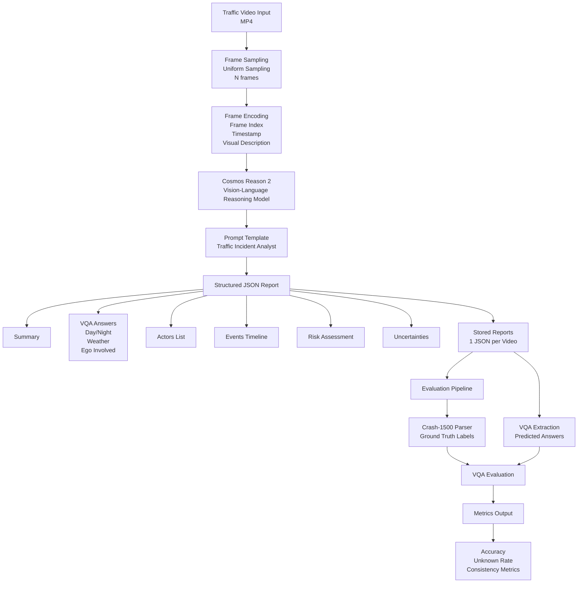

# Cosmos Reason 2: Traffic Incident Evidence Agent (TRiE-AI)

A reproducible Physical AI project for **traffic incident understanding** and **evidence-style reporting** using **NVIDIA Cosmos Reason 2**.

**What it does**

* Takes a traffic video clip (dashcam/CCTV)
* Produces a **structured evidence report** (JSON) with:
  * actors, event timeline, causal chain, and risk assessment

## Cosmos Reason 2 

NVIDIA Cosmos Reason 2 is purpose-built for Physical AI reasoning model.

## Architecture

