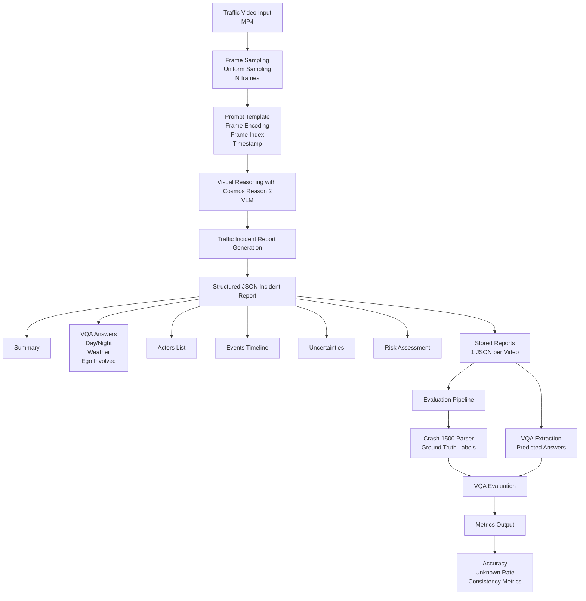

# ATIRE - Autonomous Traffic Incident Reasoning Engine 
### Powered by NVIDIA Cosmos Reason 2

ATIRE is a **physical AI reasoning pipeline** that converts traffic video into structured, evidence-grounded incident reports.

Using **Cosmos Reason 2**, ATIRE analyzes sampled frames from dashcam footage and produces interpretable outputs including actors, events timelines, environmental conditions, and risk assessment.

This project demonstrates how **vision-language reasoning models** can move beyond perception toward **structured physical reasoning** in real-world traffic environments.

----

# 1. Overview

Traffic incident analysis is still largely manual.  
Investigators must review footage frame-by-frame to determine:

- what happened
- who was involved
- whether risk or a collision occurred

This process is:

- slow
- subjective
- difficult to scale

ATIRE addresses this by transforming raw video into **structured incident intelligence**.

The system:

1. Samples frames from traffic videos
2. Sends frames to **Cosmos Reason 2**
3. Performs scene reasoning
4. Generates a structured incident report
5. Evaluates reasoning performance using **CarCrashDataset**

----

# 2. ATIRE Solution Design

The ATIRE consists of five stages.

1. Video Ingestion
2. Frame Sampling
3. Vision-Language Reasoning
4. Structured Evidence Report
5. VQA Evaluation

## 2.1. Solution Architecture Diagram


## 2.2. Solution Pipeline

### 2.2.1. Video Ingestion
Traffic videos are loaded and decoded from a dashcam or dataset sources such as CarCrashDataset.

### 2.2.2. Frame Sampling

Frames are uniformly sampled to reduce compute while preserving temporal context.

Example configuration:

```yaml
frame_sampling:
  strategy: uniform
  count: 8
  fps: 10
```

### 2.2.3. Vision-Language Reasoning

Frames are sent to Cosmos Reason 2, which performs scene reasoning using a structured prompt.

The model is instructed to:

- identify actors
- describe events
- determine environmental conditions
- assess risk
- avoid hallucinations
- remain conservative when uncertain

### 2.2.4. Structured Evidence Report

The model produces a JSON report grounded in visual evidence.

Example output:

```json
{
  "summary": "The video shows a vehicle approaching an intersection while another car passes through the crossing.",
  "q_day_night": "Day",
  "q_weather": "Snowy",
  "q_ego_involved": "No",
  "actors_list": [
    {"id": "car_1", "type": "car"},
    {"id": "car_2", "type": "car"}
  ],
  "events_timeline": [
    {
      "t_start": 0.0,
      "t_end": 4.9,
      "event": "A car passes by the ego vehicle at the intersection.",
      "confidence": 0.95,
      "frame_indices": [0,4]
    }
  ],
  "risk_assessment": {
    "level": "Low",
    "why": "No hazardous interactions or collisions observed.",
    "confidence": 0.95
  }
}
```
Each report includes:
- summary
- environmental reasoning (VQA)
- actors detected
- timeline of events
- risk assessment
- uncertainty notes

### 2.2.5 Evaluation

ATIRE is evaluated using CarCrashDataset Crash-1500.

Dataset:
* 1500 dashcam videos
* annotated environmental conditions
* ego vehicle involvement labels

Three reasoning tasks are evaluated:
1. Day vs Night classification
2. Weather detection
3. Ego vehicle involvement

Evaluation script:
```bash
python src/trie_ai/eval_vqa_ccd.py \                          
    --crash1500 ./data/CarCrash/Crash-1500.txt \
    --pred_dir ./docs/reports \
    --out ./docs/metrics/vqa_metrics.json \
    --strict_mcq
```

## 2.3. Key Contributions

ATIRE demonstrates how physical AI reasoning models can transform traffic video into structured intelligence.

Key features:

- Vision-language reasoning using Cosmos Reason 2
- Evidence-grounded structured reports
- Actor and timeline extraction
- Conservative uncertainty handling
- Evaluation with real-world traffic dataset

## 2.4. Limitations

* Dashcam perspective limits full scene visibility
* Ego vehicle involvement detection is challenging
* Temporal reasoning may degrade with sparse frame sampling

Future work could include:

* multi-frame temporal models
* trajectory tracking
* multi-camera fusion

# 3. Installation

## 3.1. Recommended environemnt

- NVIDIA GPU with ≥16GB VRAM
- 16–32 GB system RAM
- CUDA 12+
- Python 3.10

## 3.2. Setup environment

1. Clone repository:
```bash
git clone git@github.com:aamun/cosmos-reason-trie-ai.git
cd cosmos-reason-trie-ai
```

2. Setup venv environment and install dependencies:
```bash
./scripts/00_setup_env.sh
```
or just install dependencies:
```bash
pip install -r requirements.txt
```

## 3.3. Running the pipeline
Run command line:
```bash
trie --video "filepath" --out "output_filepath" --frames "nframes" --backend [stub|vllm_inprocess]
```
Example:
```bash
trie --video data/CarCrash/Crash-1500/000001.mp4 --out results/reports/000001.json --frames 8 --backend stub
```
or:
```bash
./scripts/40_generate_report.sh <video.mp4> [outdir] [frames] [stub|vllm_inprocess]
```
Also you can run the Streamlit App:
```bash
./scripts/50_run_demo_ui.sh
```

## 3.4. Run evaluation

Evaluation script:
```bash
python src/trie_ai/eval_vqa_ccd.py \                          
    --crash1500 ./data/CarCrash/Crash-1500.txt \
    --pred_dir ./docs/reports \
    --out ./docs/metrics/vqa_metrics.json \
    --strict_mcq
```

# 4. VQA Evaluation on CarCrash Dataset (1500 videos)

ATIRE was evaluated on the **CarCrashDataset (Crash-1500)** containing 1500 annotated traffic incident videos.

## 4.1. Overall Performance

| Metric              | Value     |
| ------------------- | --------- |
| Videos evaluated    | **1500**  |
| Questions per video | **3**     |
| Macro Accuracy      | **66.0%** |
| Micro Accuracy      | **66.0%** |
| Unknown Rate        | **16.2%** |
| Invalid Answers     | **0.22%** |

ATIRE achieves **66%** overall VQA accuracy across three visual reasoning tasks.
The model performs strongest on day/night classification and weather detection, while ego involvement reasoning remains more challenging due to limited viewpoint information in dashcam footage.

Evaluation performed on CarCrashDataset (Crash-1500) containing 1500 traffic incident videos with annotations for environment conditions and ego-vehicle involvement.

The system intentionally outputs "Unknown" when visual evidence is insufficient, resulting in a 16% unknown rate. This behavior prevents hallucinated conclusions and improves reliability in safety-critical applications.

## 4.2. Accuracy by Task

| Task | Accuracy | Unknown Rate |
|-----|-----|-----|
| Day / Night | **86.1%** | 11.6% |
| Weather | **72.5%** | 17.5% |
| Ego Involved | **39.4%** | 19.4% |


```
Day/Night      ███████████████████ 86%
Weather        ███████████████     72%
Ego Involved   ███████             39%
```

* Day/night and weather classification perform well due to strong visual cues in the dataset.
* Predicting ego-vehicle involvement is more challenging because dashcam viewpoints often do not clearly show the full collision context.

# 5. Conclusion

ATIRE demonstrates how Cosmos Reason 2 can move from perception to structured physical reasoning, converting traffic video into interpretable incident reports.

This approach enables scalable analysis of real-world traffic events and illustrates the potential of reasoning-based physical AI systems.

# 6. License

MIT License

# 7. Acknowledgements

* [NVIDIA Cosmos Reason 2](https://github.com/nvidia-cosmos/cosmos-reason2)
* [NVIDIA Cosmos Cookoff](https://nvidia-cosmos.github.io/cosmos-cookbook/)
* [CarCrashDataset](https://github.com/Cogito2012/CarCrashDataset)