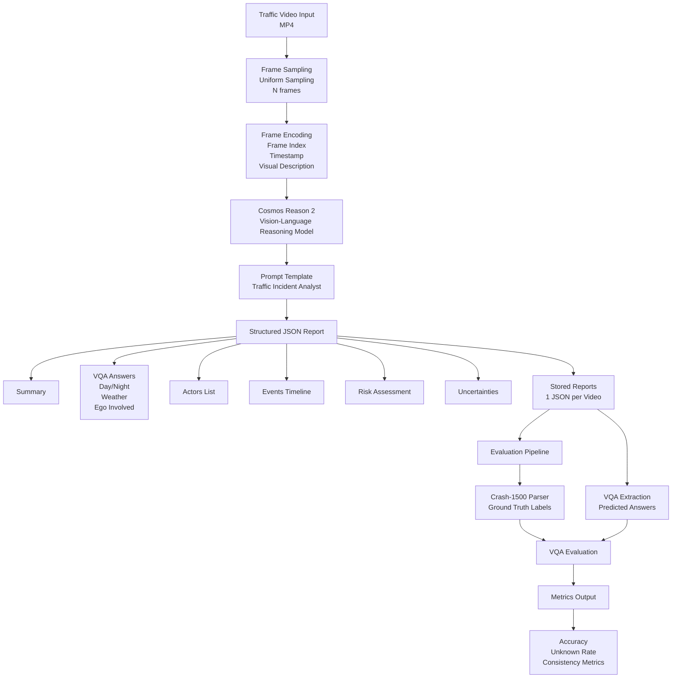

# Cosmos Reason 2: Traffic Incident Evidence Agent (TRiE-AI)

A reproducible Physical AI project for **traffic incident understanding** and **evidence-style reporting** using **NVIDIA Cosmos Reason 2**.

**What it does**

* Takes a traffic video clip (dashcam/CCTV)
* Produces a **structured evidence report** (JSON) with:
  * actors, event timeline, causal chain, and risk assessment

[UI Image]

## Cosmos Reason 2 

NVIDIA Cosmos Reason 2 is purpose-built for Physical AI reasoning model.

## Architecture



## VQA Evaluation on CarCrash Dataset (1500 videos)

ATIRE was evaluated on the **CarCrashDataset (Crash-1500)** containing 1500 annotated traffic incident videos.

### Overall Performance

| Metric              | Value     |
| ------------------- | --------- |
| Videos evaluated    | **1500**  |
| Questions per video | **3**     |
| Macro Accuracy      | **66.0%** |
| Micro Accuracy      | **66.0%** |
| Unknown Rate        | **16.2%** |
| Invalid Answers     | **0.22%** |

ATIRE achieves **66%** overall VQA accuracy across three visual reasoning tasks.
The model performs strongest on day/night classification and weather detection, while ego involvement reasoning remains more challenging due to limited viewpoint information in dashcam footage.

Evaluation performed on CarCrashDataset (Crash-1500) containing 1500 traffic incident videos with annotations for environment conditions and ego-vehicle involvement.

The system intentionally outputs "Unknown" when visual evidence is insufficient, resulting in a 16% unknown rate. This behavior prevents hallucinated conclusions and improves reliability in safety-critical applications.

### Accuracy by Task

| Task | Accuracy | Unknown Rate |
|-----|-----|-----|
| Day / Night | **86.1%** | 11.6% |
| Weather | **72.5%** | 17.5% |
| Ego Involved | **39.4%** | 19.4% |


```
Day/Night      ███████████████████ 86%
Weather        ███████████████     72%
Ego Involved   ███████             39%
```

Day/night and weather classification perform well due to strong visual cues in the dataset.

Predicting ego-vehicle involvement is more challenging because dashcam viewpoints often do not clearly show the full collision context.

### CarCrash Dataset

@InProceedings{BaoMM2020,
    author = {Bao, Wentao and Yu, Qi and Kong, Yu},
    title  = {Uncertainty-based Traffic Accident Anticipation with Spatio-Temporal Relational Learning},
    booktitle = {ACM Multimedia Conference},
    month  = {May},
    year   = {2020}
}

[CarCrashDataset Github](https://github.com/Cogito2012/CarCrashDataset)